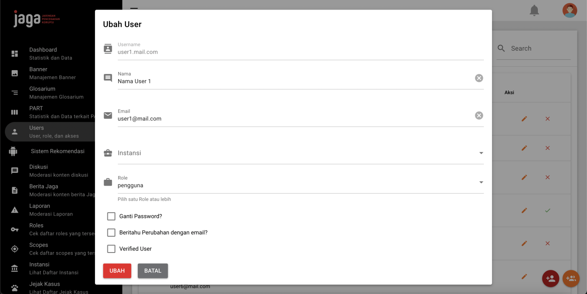
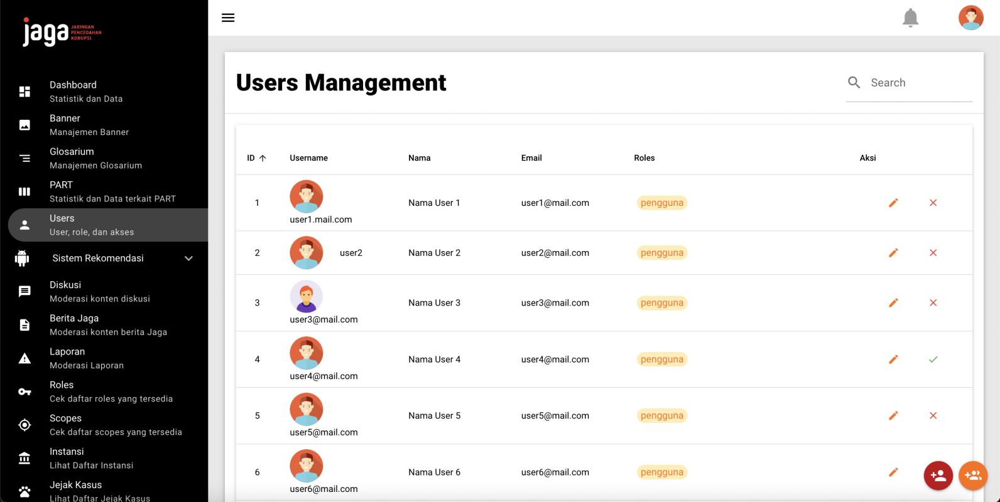
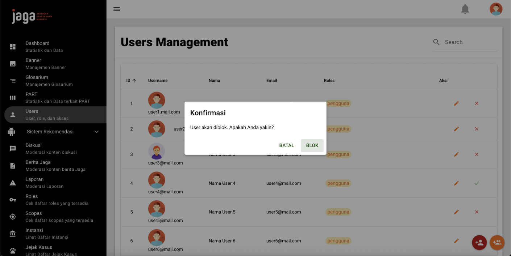

# jaga-clone-learn
Sebagai task pertama untuk Kerja Praktik

## Target
1. Setup dan install quasar (https://quasar.dev/)
2. Buat halaman CRUD sederhana tanpa connect ke API (halaman CRUD minimal terdiri dari komponen: table, text input, dropdown, checkbox, radio button, file upload, modal, confirmation dialog)





## Project Details
### Prerequisite
npm/yarn harus sudah terinstalasi (asumsi npm untuk kasus ini)

### How to Setup
```
npm init quasar
```

### How to Run
```
git clone https://github.com/dclairvoyance/jaga-clone-learn.git
cd jaga-clone-learn/quasar-project
npx quasar dev
```
Website akan dijalankan pada ip:port localhost:8080

## Progress Details
### Activity Log
| Hari, Tanggal, XM | Pekerjaan                |
| ----------------- | ------------------------ |
| Sen, 22/05/23, AM | perkenalan, setup Quasar |
| Sen, 22/05/23, PM | belajar konsep Vue |
| Sel, 23/05/23, AM | belajar konsep Quasar, structure + styling clone |
| Sel, 23/05/23, PM | belajar persistent state storage VueX dan Pinia, table |

### Identity
Damianus Clairvoyance\
13520035

### Usage
Repository ini akan digunakan untuk laporan mata kuliah IF4091 Kerja Praktik Teknik Informatika Institut Teknologi Bandung 2023